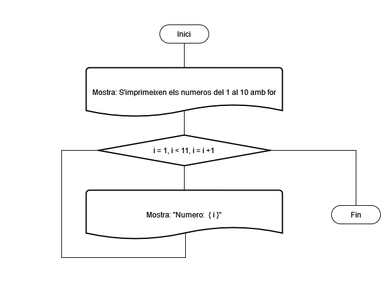
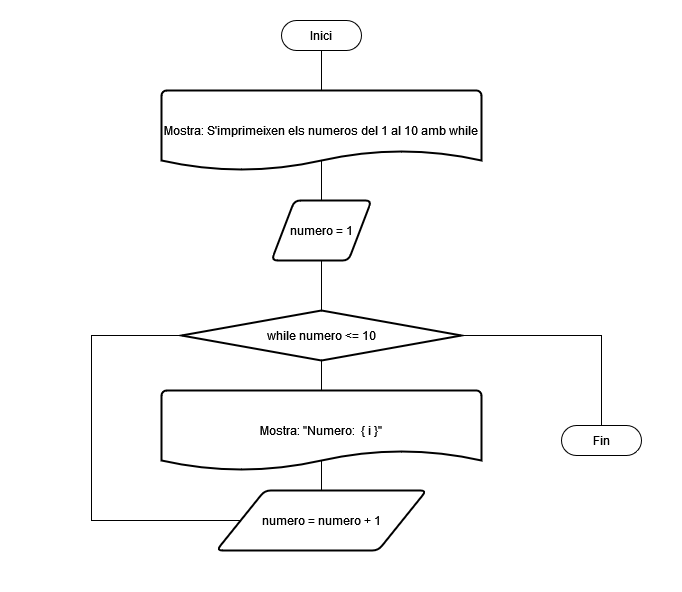
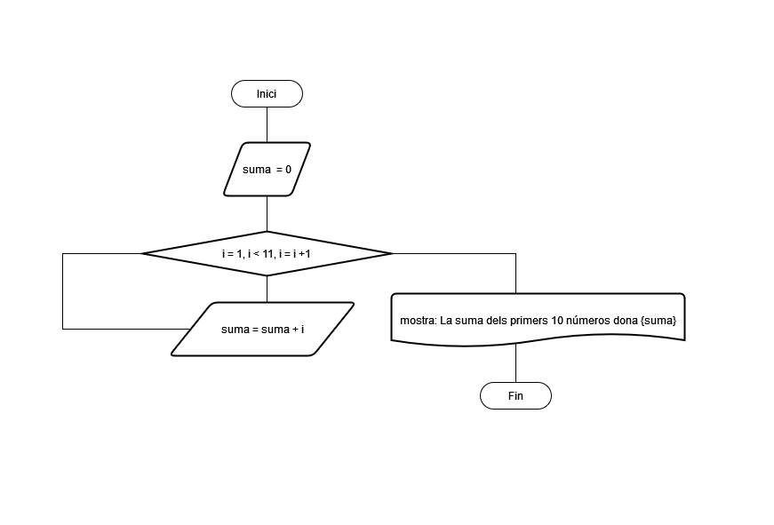
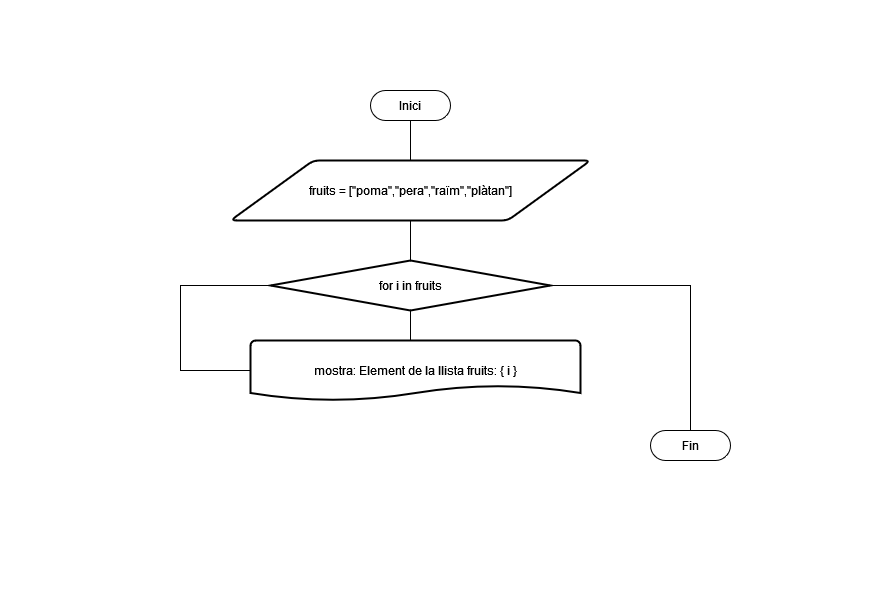
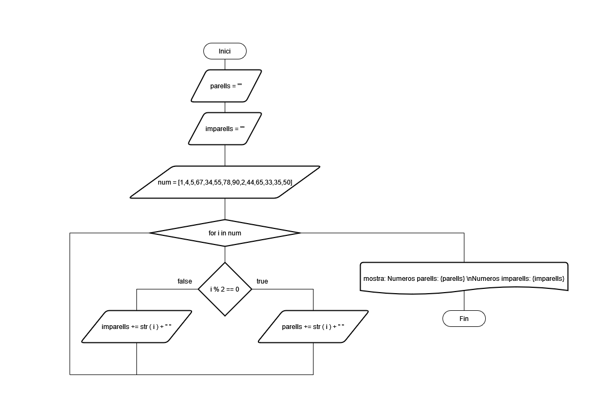
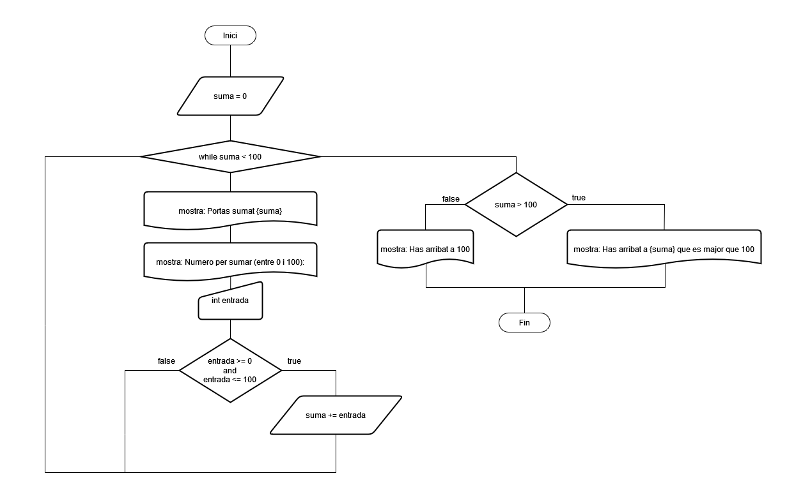
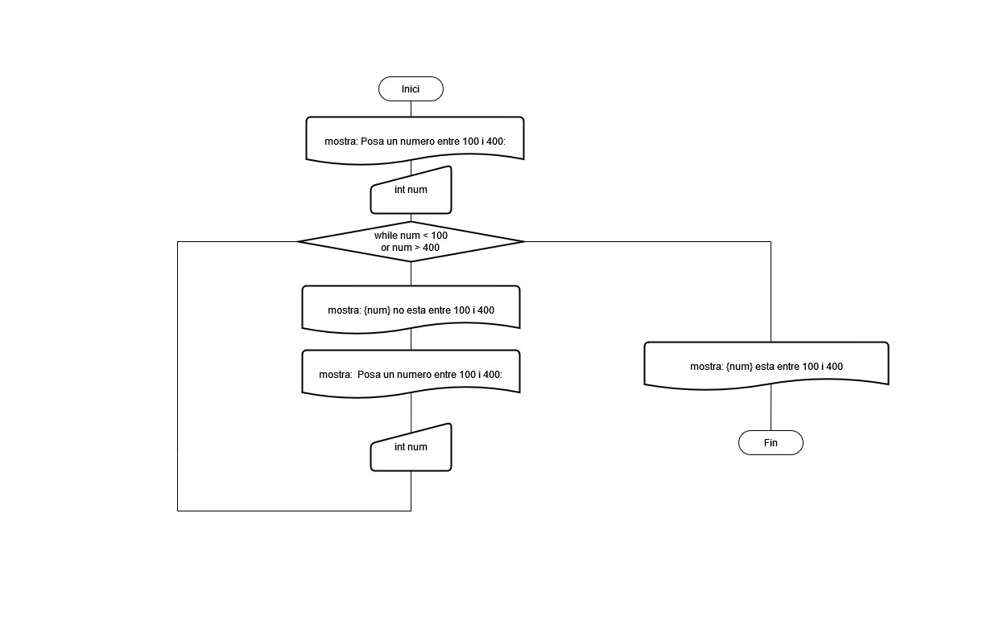

# Diagrames de flux dels exercicis de bucles amb Python

## Exercici 1:

### Amb bucle for

### Amb bucle while

## Exercici 2:

## Exercici 3:

## Exercici 4:

## Exercici 5:

## Exercici 6:

## Exercici 7:

